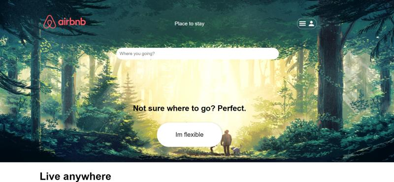

## __Educational project__ 

done to learn more about Team work, tasks, React with hooks, NodeJS, Express, Prisma, HTML/CSS, Postgres.

Using Zustand as React state management: [https://zustand-demo.pmnd.rs/](https://zustand-demo.pmnd.rs/).

Airbnb inspired (clone).

## __Homepage:__

# Airbnb-inspired-educational-pjt

### To do:

in your backend `.env` file, add:

JWT_SECRET="yourSecretWord"

### Frontend

Run Command for modules in vite-project file command ( npm i )

To start frontend server cd frontend cd vite-project npm run dev

